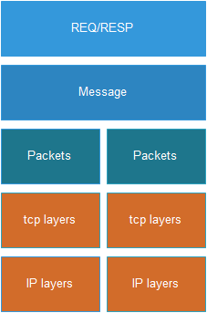
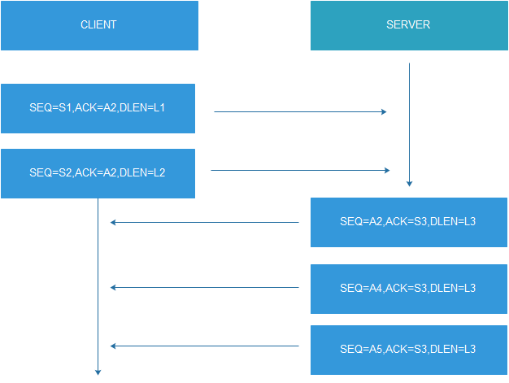

# GOKAP 使用说明

## 编译安装

1、配置好golang环境& 下载库（路径随意，已经使用gomod方式管理）

```
git clone https://github.com/piligo/gokap.git
```

2、编译

```
cd gokap && make
```

## 使用说明

### 参数说明

```
1、子命令： gokap db -->如果需要存储到数据库表时，使用此命令才初始化数据库表
```

```
 -f, --bfp string              bpf采集过滤器（默认不使用）
  -c, --capaddr string         采集监听的地址或者网卡名称，例如:0.0.0.0:8080 or eth0  (default "0.0.0.0:12800")
  -t, --captype string         采集的消息的类型标记(主要用于存储数据库中做筛选使用标志):[tcp,dubbo,http,mq] (default "tcp")
  -y, --dbtype string          数据库类型（使用的xorm库）: [mysql、mymysql、postgres、tidb、sqlite、mssql、oracle ] (default "mysql")
  -d, --dburl string           数据库的连接url (default "user:passwd@tcp(127.0.0.13306)/capturedb")
  -n, --decodename string      msg的解析组件名称(未实现，预留) (default "None")
  -h, --help                    help for gokap
  -g, --msgexpire duration      响应消息的最长时间 (default 1m0s)
  -m, --msgminisize int         消息的最小字节(主要用于过滤一些心跳消息)(default 10)
  -p, --packetexpire duration   tcp数据包的最大间隔时间，对于请求而言如果超过这个时间认为请求报文已经发送完成，主要用于收不到响应的时候也可以采集登记请求报文 (default 3s)
  -o, --storeflag              存储标记，是否存储到数据库中
  -s, --sysid string           采集系统的ID，也是用于过滤筛选数据 (default "KAP")
  -b, --syssubid string        采集子系统的ID，也是用于过滤筛选数据(default "None")

```


### 使用说明

1、初始化数据库表（如果需要将采集的数据存储到数据库表中时）

```
gokap db --help
```

```
gokap db -y mysql -d user:passwd@tcp(127.0.0.13306)/capturedb
```

### 案例

1、采集数据不存储，仅仅打印到日志里面做分析

```
nohup ./gokap -c "0.0.0.0:16090"
```

2、采集数据 并且存储到数据库中

```
nohup ./gokap -c "0.0.0.0:16090"  -y mysql -d user:passwd@tcp(127.0.0.13306)/capturedb -o 
```

# 设计分析

## 缘由

```
由于在工作之中需要采集一些交易请求和响应包用于来进行回放。而评估goreplay开源工具中，其对于tcp的采集是专业版本是需要收费的。因此，花了点时间写了一个小的工具以供使用。时间比较短，没有在进行深入的优化,但是可以作为一个采集入门处理，在此基础上进行更多功能，例如自动化测试，以及生产交易录制回放等。
TCP是底层的协议，在此基础上才是应用协议包（http，dubbo，mq）等。
如果有需要优化的可以在issue 里面提问，目前产品因已经满足个人使用需要，未有动力再去做深入优化。
```

## 通讯分类

```
一般通讯方式分为以下四种模式：同步短链接，同步长链接，异步短链接，异步长链接
常用的方式为：同步短链接，同步长链接。
对于同步而言：即1个请求就会有收取到一个响应
对于其他的2种模式并不好切分出一个完整的message。因目前场景未涉及，暂时不考虑（有预留）。
```


## 原理分析

```
针对于同步通讯场景。可以这样认为，对链路而言总是一问一响应的方式，链路每个时刻上面的数据包，要么是client的请求包，要么是server的响应包。在请求和响应的过程中，会有一个明显的分割。此工具，拆解tcp也是基于此处理。
一个具体的请求为一个msg，对于个msg而言是由多个tcp的packet组成。
详细的解释见后面的同步通讯过程处理
```


## 模型设计

模型如下：



1、底层是IP/TCP层，通过这两层获取到原始的：IP+PORT+DATA+SEQ/ACK等信息。打包为一个Packets。

2、多个Packets 形成一个Messages ，一个Message就是一个请求或者响应。

3、由于应用响应请求的时间不一定很及时，会有一个时间范围，这里定义一个请求最大的超时时间为60s 。当响应信息开始响应数据时，必须在3s内响应完成（此两者条件，一般在测试环境都是能满足的）。

4、本工具的目的只是抓取数据包，提取对应的请求响应的接口格式信息。因此，对于超时的请求是采集不到的（或者延长超时时间选项）

## 同步通讯过程

在同步短链接过程中数据包中SEQ和ACK的表现如下：



1、同步过程，所有的请求都先由客户端发起。

2、C/S建立链接过程中，seq和ack是变化的。

3、在模型里面我们只考虑有负载数据的包，因为此时的SEQ是会变化的。

4、在数据交互过程中，SEQ和ACK的变化描述如下：

```
1、在C/S两方中，对于某次交互而言，连续的数据包中ACK的值是一样的。例如：client端连续发送超长数据时，切分了几个tcp协议包，此时从上图可以看出 ACK==A2 . 服务端也是一样响应的包 ACK==S3
2、怎么确认请求的数据已经发送完成嘞？从上图可以看到，当抓取到响应的报文 的SEQ=A2 即（请求的ACK=A2）的值一样时，可以表述一次请求数据已经完成发送完成。
3、请求和响应怎么关联：通过请求的  ACK==A2 ===响应的SEQ=A2 --响应的 ACK==S3 这两者的数据包就是一次完整的交互。
4、对于响应报文如何判断已经结束：
	1、连接已经断开，此时FIN=TRUE标志
	2、局域网环境下，对于开始响应时，所有的数据包可以认为在3s内必须是会传输完成的，因此我们判断最后一个数据包的时间是否已经超过3s，如果超过3s则表示已经完成。

```

不同情况下数据如何将packets组合成一个message数据包:

```
1、请求 -- 无响应： 此时通过定时器，检查请求的时间是否已经超过60s(可配置，如果已经超过则表示完成请求的发送)。
2、请求 -- 有响应（响应及时）: 此时收到响应之后，会设置请求为已经完成。
3、请求 -- 有响应（响应不及时）：此时，请求已经（超时）删除，响应会等待超时之后，也删除消息完整。
4、请求 -- 有响应（单包超时）：此时，请求完整，响应不完整，由后续协议包检查完整性。
```

数据包乱序到达：

```
对于数据包乱序的情况，有时网络又丢包情况，此时会导致组织的message 不完整，考虑这种情况一般局域网环境都很少见，因此不考虑（后期有需要可以校验seq和datalen的关系）
```


